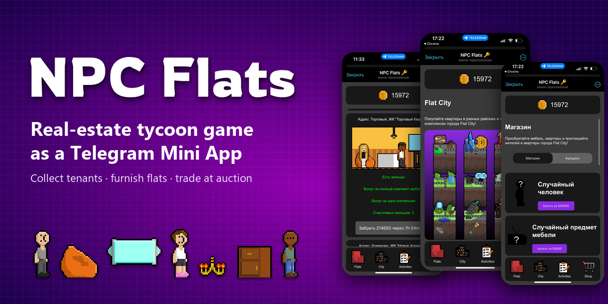
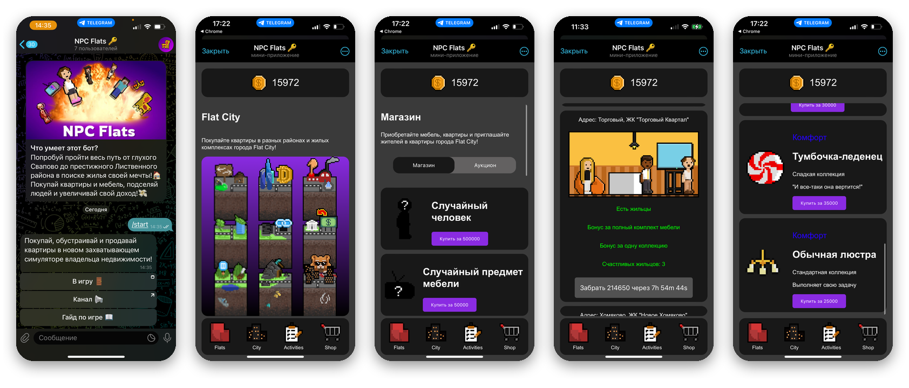
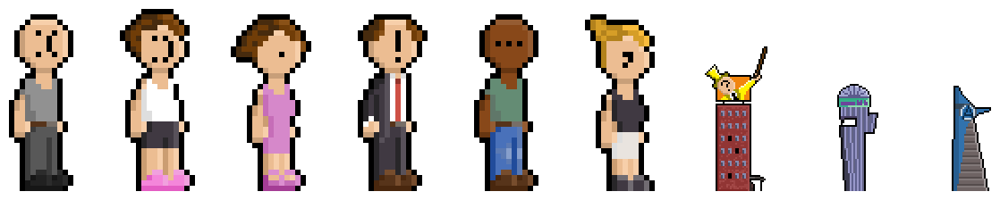
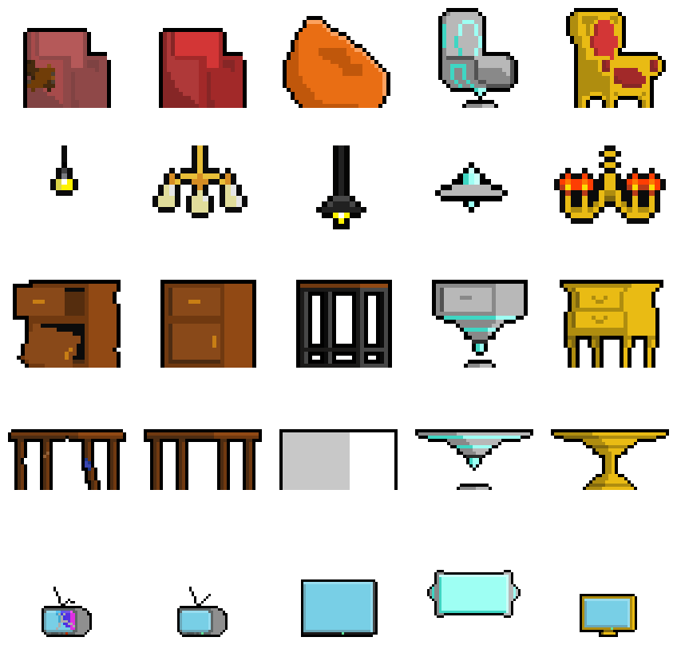
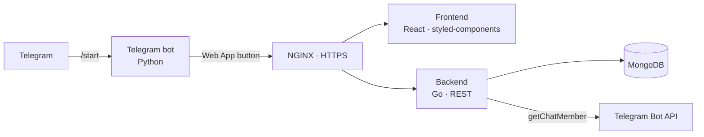

<p align="center">
  
</p>

<p align="center">
  <b>English</b> · <a href="README.ru.md">Русский</a> · <a href="README.zh-CN.md">中文</a>
</p>

<p align="center">
  
  
  
  
  
  
  
</p>

# NPC Flats

**NPC Flats** is a real-estate tycoon game built as a Telegram Mini App. Players buy flats across the districts of Flat City, move in tenants, and pick furniture that suits each tenant's traits so the flats earn as much as possible. The journey runs from a modest home all the way to the most prestigious district.

## Why businesses would use it

The game was designed as a marketing tool for real-estate agencies, developers and hotels:

- the game link is posted in the brand's Telegram channel;
- a referral system and partner channels bring in new users and grow the channel's reach;
- gamification increases audience engagement and loyalty;
- in-game districts and housing complexes can be styled after the brand's real properties, building awareness and attracting potential clients.

## Gameplay

| | |
|---|---|
| 🏙️ **City and districts** | The Flat City map: districts of different tiers, each with housing complexes and their own flat prices |
| 🧑‍🤝‍🧑 **Tenants** | Characters with their own traits; who you move in affects a flat's income |
| 🛋️ **Furniture and collections** | Economy, comfort, business and premium furniture, plus collections with full-set bonuses |
| 💰 **Passive income** | Flats accumulate money on a timer, and players collect it |
| 🎁 **Loot boxes** | "Random tenant" and "random furniture" in the shop |
| 🔨 **Auction** | Sold flats go to an auction where other players can buy them |
| 📅 **Daily rewards** | A weekly challenge for logging in every day |
| 📣 **Subscriptions and referrals** | Rewards for following partner channels and inviting friends |

## Screenshots

<p align="center">
  
</p>
<p align="center"><i>Bot chat · Flat City map · shop · a flat with tenants · furniture catalog (UI in Russian)</i></p>

### Pixel art

All game art is pixel art: tenants, buildings, and five furniture types with five variants each.

<p align="center">
  
  &nbsp;&nbsp;
  
</p>

## Architecture



| Service | Stack | Role |
|---|---|---|
| `frontend` | React, React Router, styled-components | Mini App UI |
| `backend` | Go, gorilla/mux, MongoDB driver | Game logic, economy, auction, rewards, subscription checks |
| `telegram` | Python, python-telegram-bot | Bot with a button that launches the Mini App |
| `nginx` | NGINX | HTTPS and routing |
| `mongo` | MongoDB | Users, flats, districts |

Game content (districts, tenants, furniture, partner channels) lives in text files under `backend/`: `districts/`, `people.txt`, `furniture.txt` and `channels.txt`. Their format is described in the `*_example.txt` files, and the sprites are in `backend/*_images/`. This way balance and content can change without touching the code.

## Getting started

You need Docker and Docker Compose.

```bash
git clone https://github.com/JGSnapp/NPCFlats.git
cd NPCFlats
cp .env.example .env     # set BOT_TOKEN
```

Put a TLS certificate in `nginx/certs/fullchain.pem` and `nginx/certs/privkey.pem`. Set your domain in `nginx/default.conf`, `telegram/bot.py` and the frontend URLs. Then run:

```bash
docker compose up --build
```

Once it is running, set the Mini App URL in your bot's settings via @BotFather.

## Project layout

```
NPCFlats/
├── frontend/   # React Mini App client
├── backend/    # Go: game logic, content and sprites
├── telegram/   # Python: Telegram bot
├── nginx/      # Reverse proxy config
└── docs/       # README images
```

## Status

Version 0.1 (2024): the core mechanics are implemented and both the bot and the Mini App work. The project is no longer under active development and is published as a portfolio piece.

## Presentation

[Pitch deck for real-estate agencies and hotels: boosting client engagement through a game (Google Slides, in Russian)](https://docs.google.com/presentation/d/15POKaJCLVHaBZz4DfIATxBNhrgb-zaahoQYhdtNW0xc/edit?usp=sharing)

## License

This project is licensed under the [MIT License](LICENSE).
