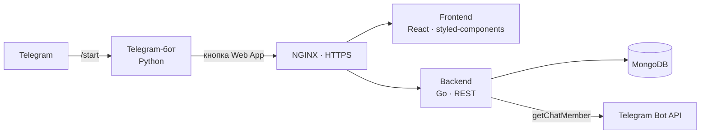

<p align="center">
  
</p>

<p align="center">
  <a href="README.md">English</a> · <b>Русский</b> · <a href="README.zh-CN.md">中文</a>
</p>

<p align="center">
  
  
  
  
  
  
  
</p>

# NPC Flats

**NPC Flats** — игра-симулятор владельца недвижимости в формате Telegram Mini App. Игрок покупает квартиры в районах города Flat City, заселяет в них жильцов и подбирает мебель с учётом их особенностей так, чтобы квартиры приносили как можно больше денег. Путь — от скромного жилья до престижного района.

## Зачем это бизнесу

Игра задумывалась как инструмент продвижения для риелторских агентств, застройщиков и отелей:

- ссылка на игру публикуется в Telegram-канале бренда;
- реферальная система и партнёрские каналы приводят новых пользователей и увеличивают охват канала;
- геймификация повышает вовлечённость и лояльность аудитории;
- районы и жилые комплексы в игре можно оформить под реальные объекты бренда — игра работает на узнаваемость и приводит потенциальных клиентов.

## Геймплей

| | |
|---|---|
| 🏙️ **Город и районы** | Карта Flat City: районы разного уровня, в каждом — жилые комплексы с квартирами своей цены |
| 🧑‍🤝‍🧑 **Жильцы** | Персонажи со своими особенностями; от подбора жильцов зависит доход квартиры |
| 🛋️ **Мебель и коллекции** | Мебель разных классов — эконом, комфорт, бизнес, премиум — и коллекции с бонусами за полный комплект |
| 💰 **Пассивный доход** | Квартиры копят деньги по таймеру, игрок забирает накопленное |
| 🎁 **Кейсы** | «Случайный человек» и «случайный предмет мебели» в магазине |
| 🔨 **Аукцион** | Проданные квартиры уходят на аукцион, где их могут купить другие игроки |
| 📅 **Ежедневные награды** | Недельный челлендж за вход в игру каждый день |
| 📣 **Подписки и рефералы** | Награды за подписку на партнёрские каналы и приглашённых друзей |

## Скриншоты

<p align="center">
  
</p>
<p align="center"><i>Диалог с ботом · карта Flat City · магазин · квартира с жильцами · каталог мебели</i></p>

### Пиксель-арт

Вся графика игры нарисована в пиксель-арте: жильцы, дома и пять типов мебели, у каждого по пять вариантов.

<p align="center">
  
  &nbsp;&nbsp;
  
</p>

## Архитектура



| Сервис | Стек | Назначение |
|---|---|---|
| `frontend` | React, React Router, styled-components | Интерфейс мини-приложения |
| `backend` | Go, gorilla/mux, MongoDB driver | Игровая логика, экономика, аукцион, награды, проверка подписок |
| `telegram` | Python, python-telegram-bot | Бот с кнопкой запуска мини-приложения |
| `nginx` | NGINX | HTTPS и маршрутизация |
| `mongo` | MongoDB | Пользователи, квартиры, районы |

Игровой контент — районы, жильцы, мебель, партнёрские каналы — задаётся текстовыми файлами в `backend/` (`districts/`, `people.txt`, `furniture.txt`, `channels.txt`; формат описан в файлах `*_example.txt`), а спрайты лежат в `backend/*_images/`. Так баланс и контент меняются без правки кода.

## Запуск

Нужны Docker и Docker Compose.

```bash
git clone https://github.com/JGSnapp/NPCFlats.git
cd NPCFlats
cp .env.example .env     # укажите BOT_TOKEN
```

Положите TLS-сертификат в `nginx/certs/fullchain.pem` и `nginx/certs/privkey.pem`, укажите свой домен в `nginx/default.conf`, `telegram/bot.py` и адресах фронтенда, затем:

```bash
docker compose up --build
```

После запуска укажите URL мини-приложения в настройках бота через @BotFather.

## Структура

```
NPCFlats/
├── frontend/   # React-клиент мини-приложения
├── backend/    # Go: игровая логика + контент и спрайты
├── telegram/   # Python: Telegram-бот
├── nginx/      # Конфигурация реверс-прокси
└── docs/       # Изображения для README
```

## Статус

Версия 0.1 (2024): основные механики реализованы, бот и мини-приложение работают. Активная разработка не ведётся; проект опубликован как портфолио.

## Презентация

[Презентация для риелторских агентств и отелей: как повысить вовлечённость клиентов через игру (Google Slides)](https://docs.google.com/presentation/d/15POKaJCLVHaBZz4DfIATxBNhrgb-zaahoQYhdtNW0xc/edit?usp=sharing)

## Лицензия

Проект распространяется под лицензией [MIT](LICENSE).
