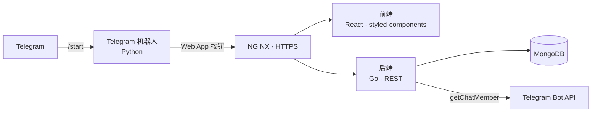

<p align="center">
  
</p>

<p align="center">
  <a href="README.md">English</a> · <a href="README.ru.md">Русский</a> · <b>中文</b>
</p>

<p align="center">
  
  
  
  
  
  
  
</p>

# NPC Flats

**NPC Flats** 是一款以 Telegram Mini App 形式呈现的房产大亨模拟游戏。玩家在 Flat City 的各个城区购买公寓、招募租客，并根据每位租客的特点挑选家具，让公寓尽可能多地创造收益。从简陋的住所起步，一路奋斗到最高端的城区。

## 商业价值

这款游戏最初是为房产中介、开发商和酒店设计的营销工具：

- 游戏链接发布在品牌的 Telegram 频道中；
- 邀请机制和合作频道带来新用户，扩大频道覆盖面；
- 游戏化设计提升受众的参与度和忠诚度；
- 游戏中的城区和住宅小区可以按品牌的真实楼盘进行设计，提升品牌知名度并吸引潜在客户。

## 玩法

| | |
|---|---|
| 🏙️ **城市与城区** | Flat City 地图：不同等级的城区，每个城区都有价格各异的住宅小区 |
| 🧑‍🤝‍🧑 **租客** | 每个角色都有自己的特点，入住的租客会影响公寓收益 |
| 🛋️ **家具与收藏** | 经济、舒适、商务、尊享四档家具，以及集齐整套可获奖励的收藏系列 |
| 💰 **被动收入** | 公寓按计时器积累收益，玩家随时领取 |
| 🎁 **盲盒** | 商店中的"随机租客"和"随机家具" |
| 🔨 **拍卖行** | 卖出的公寓会进入拍卖行，其他玩家可以竞购 |
| 📅 **每日奖励** | 连续七天登录的每周挑战 |
| 📣 **订阅与邀请** | 关注合作频道和邀请好友均可获得奖励 |

## 截图

<p align="center">
  
</p>
<p align="center"><i>机器人对话 · Flat City 地图 · 商店 · 住有租客的公寓 · 家具目录（界面为俄语）</i></p>

### 像素美术

游戏中的所有美术均为像素风格：租客、建筑，以及五类家具，每类各有五种款式。

<p align="center">
  
  &nbsp;&nbsp;
  
</p>

## 架构



| 服务 | 技术栈 | 作用 |
|---|---|---|
| `frontend` | React、React Router、styled-components | Mini App 界面 |
| `backend` | Go、gorilla/mux、MongoDB 驱动 | 游戏逻辑、经济系统、拍卖、奖励、订阅校验 |
| `telegram` | Python、python-telegram-bot | 带有启动 Mini App 按钮的机器人 |
| `nginx` | NGINX | HTTPS 与路由 |
| `mongo` | MongoDB | 用户、公寓、城区数据 |

游戏内容（城区、租客、家具、合作频道）以文本文件的形式存放在 `backend/` 中：`districts/`、`people.txt`、`furniture.txt` 和 `channels.txt`，格式说明见 `*_example.txt`；精灵图位于 `backend/*_images/`。这样无需修改代码即可调整数值平衡和内容。

## 快速开始

需要安装 Docker 和 Docker Compose。

```bash
git clone https://github.com/JGSnapp/NPCFlats.git
cd NPCFlats
cp .env.example .env     # 填写 BOT_TOKEN
```

将 TLS 证书放到 `nginx/certs/fullchain.pem` 和 `nginx/certs/privkey.pem`，在 `nginx/default.conf`、`telegram/bot.py` 和前端地址中填写你自己的域名，然后运行：

```bash
docker compose up --build
```

启动后，通过 @BotFather 在机器人设置中填写 Mini App 的地址。

## 目录结构

```
NPCFlats/
├── frontend/   # React Mini App 客户端
├── backend/    # Go：游戏逻辑、内容与精灵图
├── telegram/   # Python：Telegram 机器人
├── nginx/      # 反向代理配置
└── docs/       # README 配图
```

## 项目状态

版本 0.1（2024）：核心玩法已实现，机器人和 Mini App 均可正常运行。目前已不再积极开发，作为作品集公开发布。

## 演示文稿

[面向房产中介和酒店的演示：如何通过游戏提升客户参与度（Google Slides，俄语）](https://docs.google.com/presentation/d/15POKaJCLVHaBZz4DfIATxBNhrgb-zaahoQYhdtNW0xc/edit?usp=sharing)

## 许可证

本项目基于 [MIT 许可证](LICENSE) 开源。
